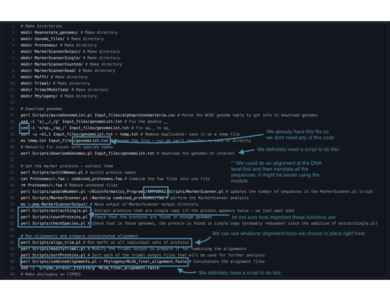

# 812-Final-Assignment

### Part 1: MSA
1. Download sequences (probably genomes from n proteobacteria, we really dont need that many)
2. Find the genes we need (looks like theres a tool in the alignments module to do that)
3. align sequences at that gene (module, but we can also incorporate elements from georges scripts)

- https://www.overleaf.com/ for .tex to .pdf

### Part 2: Phylogeny(?, or should we do this first)

